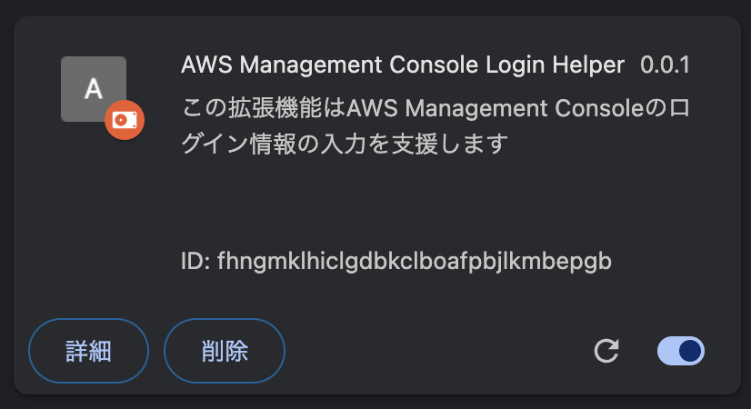

# AWS Console Management Login Helper

## 概要

このChrome拡張機能はAWS Management Consoleのログイン情報の入力を支援します。

毎回、アカウントID・パスワード・ユーザー名を入力する手間を省きます。


## 使用技術

* [CRXJS](https://crxjs.dev/vite-plugin/)
* [Vite](https://vitejs.dev/)
* [TypeScript](https://www.typescriptlang.org/)
* [React](https://react.dev/)
* [React Router](https://reactrouter.com/)
* [MUI](https://mui.com/)

## 使い方

### アカウントの追加

アプリのアイコンをクリックしてウィンドウを表示します。


追加ボタン（＋）を押します。


アカウント名・アカウントID・パスワード・ユーザー名を入力し、「登録する」ボタンを押します。

* アカウント名は識別・検索用の名前です。
* アカウントID・パスワード・ユーザー名はAWSのログイン情報です。


### ログインページの表示

アプリのアイコンをクリックしてウィンドウを表示します。


ホームボタンを押します。


AWS Management Consoleのログイン画面が表示されます。

### ログイン

アプリのアイコンをクリックしてウィンドウを表示します。


検索欄に検索キーワードを入力して、Enterキーを押下または検索ボタンを押し、アカウントを絞り込みます。


アカウントをクリックします。


アカウントのログイン情報が入力されます。

## ビルド

nodeモジュールをインストールします。

```shell
npm install
```

開発用にビルドします。

```shell
npm run dev
```

本番用にビルドします。

```shell
npm run build
```

## インストール

ビルドが完了したら、ChromeまたはEdgeを起動して`chrome://extensions`を開きます。

「デベロッパーモード」を有効にし、「パッケージ化されていない拡張機能を読み込む」ボタンからdistフォルダーを読み込みます。




## その他

* AWSマネージメントコンソールのフッターにアカウント名を表示する機能は[Display AWS Account Name](https://chromewebstore.google.com/detail/display-aws-account-name/njalignmbnobepnkfolngjbclaomfjig)を参考にしました。
